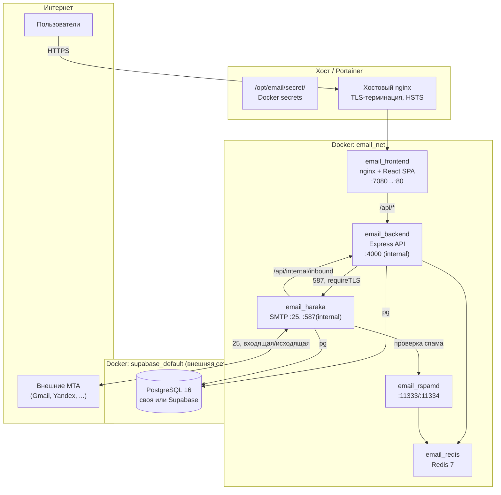

# Corporate Mail — корпоративный почтовый сервер

Self-hosted корпоративный почтовый сервер (веб-клиент + приём/отправка внешней почты + админ-панель) для произвольного количества корпоративных доменов. Полностью на своём стеке: React-фронтенд, Express-бэкенд, собственный MTA на Node.js (Haraka), антиспам (Rspamd), PostgreSQL, Redis. Разворачивается через Docker Compose (Portainer).

> Этот файл — практическое руководство «что это и как поднять». Историю решений и полный план реализации по фазам см. в [`implementation_plan.md`](./implementation_plan.md); правила для AI-агентов, работающих с репозиторием — в [`AGENTS.md`](./AGENTS.md).

---

## Содержание

1. [Возможности](#возможности)
2. [Технологический стек](#технологический-стек)
3. [Архитектура](#архитектура)
4. [Структура репозитория](#структура-репозитория)
5. [Быстрый старт (локальная разработка)](#быстрый-старт-локальная-разработка)
6. [Секреты](#секреты)
7. [Переменные окружения](#переменные-окружения)
8. [Развёртывание в production (Portainer)](#развёртывание-в-production-portainer)
9. [Настройка серверных компонентов](#настройка-серверных-компонентов)
   - [PostgreSQL](#postgresql)
   - [Redis](#redis)
   - [Haraka — SMTP MTA](#haraka--smtp-mta)
   - [Rspamd — антиспам](#rspamd--антиспам)
   - [Nginx (фронтенд-контейнер)](#nginx-фронтенд-контейнер)
   - [Хостовый reverse-proxy и TLS](#хостовый-reverse-proxy-и-tls)
   - [DNS-записи домена](#dns-записи-домена)
10. [Безопасность](#безопасность)
11. [Резервное копирование](#резервное-копирование)
12. [Диагностика и типичные проблемы](#диагностика-и-типичные-проблемы)

---

## Возможности

- **Почтовый веб-клиент** (3 панели: папки / список писем / просмотр), с виртуализированным списком писем.
- **Визуальный редактор писем** (TipTap): форматирование, ссылки, изображения, таблицы, выравнивание, цвет текста; та же основа — для подписи пользователя.
- **Вложения** до 25 МБ (`MAIL_MAX_ATTACHMENT_SIZE`), с блокировкой исполняемых файлов при загрузке; хранение — на томе `mail_data`, в БД только метаданные.
- **Отложенная отправка писем** — очередь на BullMQ/Redis с фолбэком на in-memory таймеры, если Redis недоступен.
- **Real-time обновления** — SSE-канал `/api/emails/events` (новые письма, статусы) без polling.
- **Общая адресная книга домена** + личные контакты, группы контактов, автодополнение адресатов.
- **Правила фильтрации** входящей почты (условия по from/to/subject/вложениям → перемещение в папку, отметка прочитанным, удаление).
- **Подпись и автоответчик** пользователя.
- **Полноценный приём и отправка внешней почты**: собственный MTA (Haraka) на портах 25/587, DKIM-подпись исходящих писем, антиспам-проверка входящих (Rspamd: DKIM/SPF/DMARC/RBL/Bayes).
- **Мультидоменность без ограничений**: каждый домен настраивается в админке, включая собственный DKIM-ключ.
- **DNS-мастер в админке**: для каждого домена — карточки требуемых записей (A/PTR/MX/SPF/DKIM/DMARC) со статусом и кнопкой «Проверить» (реальный DNS-lookup).
- **Администрирование**: домены, пользователи, роли (`superadmin`/`admin`/`user`), алиасы (`alias@domain` → пользователь), системная статистика, журнал аудита, переключение подключения к БД без пересборки образа.
- **Telegram-уведомления** о новых письмах (собственный бот, настраивается в админке, поллинг Telegram Bot API).
- **Первый зарегистрированный пользователь** автоматически становится `superadmin`, домен создаётся из его email.

## Технологический стек

| Слой | Технологии |
|---|---|
| **Frontend** | React 18 · TypeScript (strict) · Vite 5 · **CSS Modules** (без UI-китов типа MUI) · Zustand 4 (стор) · TanStack Query 5 (кэш запросов) · React Router 6 · axios · TipTap 2 (WYSIWYG) · react-virtuoso (виртуализация списка писем) |
| **Backend** | Node.js 20 · Express 4 · TypeScript (strict) · `pg` (PostgreSQL-драйвер, без ORM) · Zod (валидация) · `bcryptjs` (пароли) · `jsonwebtoken` (JWT) · `nodemailer` (SMTP-клиент к Haraka) · `mailparser` (парсинг входящих MIME) · `multer` (upload, memory storage) · `sanitize-html` · `helmet` · `express-rate-limit` · `ioredis` · `bullmq` (очередь отложенной отправки) |
| **MTA** | **Haraka** (Node.js SMTP-сервер) — приём (25) и внутренний submission (587); кастомные плагины на `pg` для получателей/DKIM/доставки во backend |
| **Антиспам** | **Rspamd** (DKIM/SPF/DMARC/RBL/Bayes-классификатор с Redis-backend) |
| **БД** | PostgreSQL 16 (своя в стеке, либо внешняя — Supabase/соседний контейнер, переключается в один клик) |
| **Кэш / очереди** | Redis 7 (кэш + BullMQ для отложенной отправки) |
| **Инфраструктура** | Docker Compose · nginx (статика + reverse proxy внутри контейнера `frontend`) · `su-exec`/`tini`/`setcap` (дроп привилегий) · Docker secrets |

Стек и конвенции унаследованы от эталонного проекта `Maps-info` (см. `AGENTS.md`).

## Архитектура



**Поток исходящего письма:** Backend → nodemailer → Haraka:587 (только внутри `email_net`, доступ разрешён только backend-контейнеру) → Haraka подписывает DKIM своим плагином → отдаёт письмо во внешний мир напрямую по MX получателя → Haraka же перехватывает итоговый «сырой» текст письма (после DKIM) и дозаписывает его в `emails.raw_source`, чтобы «оригинал письма» в интерфейсе показывал реальные заголовки.

**Поток входящего письма:** внешний MTA → Haraka:25 → плагин проверяет получателя в БД (`users`/`aliases`) → Rspamd оценивает спам (DKIM/SPF/DMARC/RBL/Bayes, добавляет `X-Spam-*` заголовки, может отклонить при высоком score) → Haraka передаёт письмо в backend через внутренний webhook `POST /api/internal/inbound` (авторизация — общий секрет в заголовке `X-Internal-Secret`, доступен только по внутренней сети) → backend парсит MIME, сохраняет письмо/вложения, применяет правила фильтрации, раскладывает по папке (`inbox`/`spam`).

## Структура репозитория

```
.
├── docker-compose.yml            # Основной стек для Portainer (frontend/backend/redis/haraka/rspamd)
├── docker-compose.local.yml      # Оверрайд: своя PostgreSQL вместо внешней БД (для разработки)
├── .env.example                  # Пример переменных окружения для docker compose
├── AGENTS.md                     # Инструкции и зафиксированные решения для AI-агентов
├── implementation_plan.md        # Детальный план реализации по фазам
│
├── frontend/                     # React SPA
│   ├── src/
│   │   ├── components/           # Layout, Login, Mail, Contacts, Settings, Admin
│   │   ├── store/                # Zustand: authStore, emailStore
│   │   └── services/api.ts       # axios + JWT-interceptor
│   ├── Dockerfile                # Multi-stage: vite build → nginx:stable-alpine
│   └── nginx.conf                # Reverse proxy к backend, security-заголовки, SSE, лимиты тела
│
├── backend/                      # Express API
│   └── src/
│       ├── config/                # env.ts (Zod-схема), loadSecrets.ts, constants.ts
│       ├── middleware/            # authGuard, rateLimiter, upload, errorHandler
│       ├── routes/                # auth, email, folder, attachment, contact, rule, settings,
│       │                          # admin.domains/users/aliases/system, internal, health, avatar
│       └── services/              # db, auth, email, inbound, mta, dns, dkim, domain, alias,
│                                   # folder, contact, rule, audit, cache, cron, scheduler,
│                                   # telegram, attachment, user
│
├── haraka/                       # Конфигурация и плагины MTA
│   ├── config/                   # smtp.ini, tls.ini, dkim.ini, rspamd.ini, connection.ini, plugins
│   ├── plugins/                  # allow_submission_relay, rcpt_to.postgres, db,
│   │                             # queue/deliver_backend, queue/capture_outbound_raw
│   ├── scripts/sync-dkim-keys.js # Синхронизация DKIM-ключей доменов из БД в файлы Haraka
│   ├── Dockerfile
│   └── docker-entrypoint.sh      # Копирование TLS-сертификатов, дроп привилегий до node
│
├── rspamd/local.d/               # Оверрайды конфигурации Rspamd (worker-*, bayes, redis)
│
└── secrets/                      # .gitignored; только *.example и README.md в гите
    └── README.md                 # Описание всех секретов и приоритета их загрузки
```

## Быстрый старт (локальная разработка)

### Вариант A — без Docker (быстрее для разработки фронта/бэка)

```bash
cd backend && npm install && npm run dev     # http://localhost:4000
cd frontend && npm install && npm run dev    # http://localhost:5173 (proxy /api → :4000)
```

Backend в этом режиме поднимется с дефолтными значениями `env.ts` (см. таблицу переменных ниже) — для реальной работы нужна доступная PostgreSQL (см. `docker-compose.local.yml` для локальной БД в Docker) и файл секретов (см. следующий раздел).

### Вариант B — полный стек в Docker

```bash
cp secrets/*.example secrets/
# переименуйте каждый файл, убрав .example, и заполните значением

set EMAIL_SECRETS_DIR=./secrets        # PowerShell: $env:EMAIL_SECRETS_DIR="./secrets"
docker compose -f docker-compose.yml -f docker-compose.local.yml up -d --build
```

- `docker-compose.local.yml` поднимает собственный `email_db` (PostgreSQL 16) вместо внешней БД — удобно для локальной разработки без Supabase.
- Без этого файла `docker-compose.yml` ожидает внешнюю сеть `supabase_default` и БД в ней (`docker network ls | findstr supabase_default`).
- Откройте `http://127.0.0.1:7080` → первый зарегистрированный пользователь стаёт `superadmin`.
- MTA (Haraka) включён по умолчанию (`MTA_ENABLED=true`); для чистой разработки без реальной отправки почты наружу можно временно поставить `MTA_ENABLED=false` в `.env`.

## Секреты

Секреты **никогда** не хардкодятся — только файлы (Docker secrets в проде, каталог `secrets/` локально). Приоритет загрузки (`backend/src/config/loadSecrets.ts`):

```
переменная окружения → *_FILE (путь к файлу секрета) → EMAIL_SECRETS_DIR/<файл> → /opt/email/secret/<файл> → ./secrets → ../secrets
```

| Файл | Обязателен | Назначение |
|---|---|---|
| `database_url` | да (prod, внешняя БД) | Строка подключения PostgreSQL |
| `db_password` | да | Пароль PostgreSQL (для встроенного `email_db`) |
| `jwt_secret` | да | Секрет подписи JWT, минимум 16 символов, без дефолтных шаблонов в проде |
| `redis_password` | да | Пароль Redis (кэш + BullMQ) |
| `internal_api_secret` | да | Общий секрет для webhook Haraka → `POST /api/internal/inbound` |
| `server_public_ip` | нет | Публичный IP сервера — используется в DNS-мастере (A/SPF-записи) |
| `mail_hostname` | нет | Каноническое имя MTA (например `mail.example.com`) — EHLO, PTR, сертификат |

Подробности и пример `database_url` — в [`secrets/README.md`](./secrets/README.md).

## Переменные окружения

Полная Zod-схема — `backend/src/config/env.ts`. Основные:

| Переменная | Умолч. | Описание |
|---|---|---|
| `NODE_ENV` | `development` | `development` / `production` / `test`; в `production` включаются доп. проверки (запрет дефолтного `JWT_SECRET`, `CORS_ORIGIN=*`) |
| `PORT` | `4000` | Порт backend внутри контейнера |
| `DB_MODE` | `external` | `external` — по `DATABASE_URL`; `local` — по `DB_HOST/DB_PORT/DB_USER/DB_NAME` |
| `CORS_ORIGIN` | `http://localhost:5173` | Список разрешённых origin через запятую; **в проде — реальный домен фронтенда**, не `*` |
| `AUTH_ENABLED` / `AUTH_ALLOW_REGISTER` | `true` / `false` | Включение авторизации / самостоятельной регистрации новых пользователей (кроме первого суперадмина) |
| `JWT_EXPIRES_IN` | `8h` | Время жизни JWT |
| `RATE_LIMIT_WINDOW_MS` / `RATE_LIMIT_MAX` | `60000` / `120` | Общий rate-limit API. Отдельно, жёстче — `loginLimiter` на `/api/auth/login`: 4 попытки / 3 часа с одного IP (успешные входы лимит не расходуют) |
| `MAIL_MAX_ATTACHMENT_SIZE` | `26214400` (25 МБ) | Лимит одного вложения |
| `SERVER_PUBLIC_IP` | `127.0.0.1` | Публичный IP — для генерации DNS A/SPF записей в админке |
| `MAIL_HOSTNAME` | — | Имя MTA (EHLO/PTR/сертификат); без него DNS-мастер и Haraka используют плейсхолдер |
| `MTA_ENABLED` | `false` (`true` в compose) | Включение отправки через Haraka |
| `HARAKA_HOST` / `HARAKA_SUBMISSION_PORT` | `email_haraka` / `587` | Адрес Haraka для backend (внутри `email_net`) |
| `INTERNAL_API_SECRET` | — | Секрет webhook `/api/internal/inbound` (см. секреты) |
| `APP_TIMEZONE` | `Europe/Moscow` | Часовой пояс для отображения времени |

## Развёртывание в production (Portainer)

1. **Подготовьте каталоги на хосте** (доступны Portainer-контейнеру через bind mount `/opt/`):
   - `/opt/email/secret/` — файлы секретов (см. таблицу выше), права `644` (см. раздел «Безопасность» — почему не `600`).
   - `/opt/email/` — опционально `server_public_ip`, `mail_hostname`, если не заданы переменными стека.
2. **Сеть БД.** Если используется внешняя PostgreSQL (например, Supabase в соседнем стеке) — убедитесь, что сеть `supabase_default` существует и в ней доступна БД. Если своя БД — добавьте оверрайд `docker-compose.local.yml` в список файлов стека в Portainer.
3. **Deploy стека** из git-репозитория (Portainer тянет `docker-compose.yml`), переменные — через `.env` стека или Environment variables в UI Portainer:
   - `CORS_ORIGIN=https://<ваш-домен-фронтенда>`
   - `SERVER_PUBLIC_IP=<публичный IP сервера>`
   - `MAIL_HOSTNAME=mail.<ваш-домен>`
   - `AUTH_ALLOW_REGISTER=false` (после создания нужных пользователей суперадмином)
4. **Хостовый reverse-proxy** (nginx/Caddy — вне этого репозитория) должен: терминировать TLS, отдавать HSTS, и проксировать на `127.0.0.1:7080` (порт контейнера `frontend`). См. [«Хостовый reverse-proxy и TLS»](#хостовый-reverse-proxy-и-tls).
5. Откройте сайт → зарегистрируйте первого пользователя (→ `superadmin`, домен создаётся из его email).
6. В админке добавьте домен(ы), сгенерируйте DKIM-ключ, настройте DNS-записи по мастеру (см. ниже), подождите верификации.
7. После первого запуска — `AUTH_ALLOW_REGISTER=false`, создавайте пользователей только через админку.

## Настройка серверных компонентов

### PostgreSQL

- **Своя** (по умолчанию для `docker-compose.local.yml`): `postgres:16-alpine`, пароль — Docker secret `db_password`, том `postgres_data`.
- **Внешняя** (по умолчанию в `docker-compose.yml`, `DB_MODE=external`): строка подключения — секрет `database_url`, сеть — `supabase_default` (внешняя, `external: true` в compose; должна существовать до деплоя).
- **Переключение без пересборки**: `Админка → Система → Подключение БД` — тестовый пул (`POST /api/admin/system/db-config/test`) → запись нового `database_url` (`PUT /api/admin/system/db-config`) → требуется перезапуск контейнера `backend`.
- **Миграции** — inline в `backend/src/services/db.service.ts` → `runMigrations()`, идемпотентны (`CREATE TABLE IF NOT EXISTS`, `ALTER TABLE ... ADD COLUMN IF NOT EXISTS`), выполняются автоматически при старте backend. Полнотекстовый поиск писем — `tsvector`/GIN-индекс.

### Redis

- Единственный инстанс `email_redis` (пароль — секрет `redis_password`) используется для двух ролей:
  - **Кэш** приложения (`cache.service.ts`).
  - **Очередь отложенной отправки** (`bullmq`, `scheduler.service.ts`) — если Redis недоступен, backend автоматически переключается на in-memory таймеры (переживают только до перезапуска контейнера — для надёжной работы Redis обязателен).
- Также используется **Rspamd** (Bayes-классификатор, `backend = redis`, тот же пароль передаётся контейнеру через `redis_password`).

### Haraka — SMTP MTA

Конфиг — `haraka/config/`, кастомные плагины — `haraka/plugins/`.

| Файл | Назначение |
|---|---|
| `config/plugins` | Порядок плагинов: `tls → allow_submission_relay → haraka-plugin-dkim → rcpt_to.postgres → rspamd → queue/deliver_backend → queue/capture_outbound_raw → queue/deliver` |
| `config/smtp.ini` | `listen=0.0.0.0:25,0.0.0.0:587`, лимит письма `26214400` (25 МБ, синхронизирован с `MAIL_MAX_ATTACHMENT_SIZE`) |
| `config/tls.ini` | Пути к сертификату/ключу (копируются entrypoint'ом из `/etc/letsencrypt/live/<MAIL_HOSTNAME>/` при старте контейнера) |
| `config/dkim.ini` | `sign.enabled=true` — подпись исходящих писем; `verify.enabled=false` — **намеренно**: верификацию входящих DKIM/SPF/DMARC полноценно делает Rspamd (см. ниже), включать дублирующую проверку в Haraka не нужно |
| `config/rspamd.ini` | `host=email_rspamd port=11333`, `add_headers=always`, `reject.spam=true` — реальный SMTP-reject при рекомендации Rspamd |
| `plugins/allow_submission_relay.js` | Разрешает relay на порту 587 **только** DNS-резолвленному IP контейнера `email_backend` (обновляется раз в 5 минут — Docker может пересоздать backend с новым IP) |
| `plugins/rcpt_to.postgres.js` | Отклоняет входящие письма для несуществующих адресов (проверка по `users`/`aliases`) |
| `plugins/queue/deliver_backend.js` | Для входящих (не relaying, не порт 587) — POST на `email_backend:4000/api/internal/inbound` с общим секретом |
| `plugins/queue/capture_outbound_raw.js` | Для исходящих (relaying) — сохраняет реальный подписанный DKIM-текст письма в `emails.raw_source` |
| `scripts/sync-dkim-keys.js` | При старте контейнера читает `dkim_private_key` активных доменов из БД и раскладывает по `config/dkim/<domain>/private` |

**Порты и сетевой доступ:**
- **25 (приём почты)** — публикуется на хост (`ports: "25:25"`), нужен внешним MTA для доставки. STARTTLS предлагается оппортунистически (не обязателен) — это стандартная практика для входящей почты, обязательный STARTTLS на 25-м порту ломает доставку от серверов без поддержки TLS без выигрыша в безопасности (аутентичность отправителя проверяется SPF/DKIM/DMARC, а не транспортным шифрованием).
- **587 (submission)** — **не публикуется на хост** (`expose: "587"`), доступен только внутри Docker-сети `email_net`; relay разрешён только контейнеру `email_backend` (см. `allow_submission_relay.js`). Backend подключается к нему с **`requireTLS: true`** (`backend/src/services/mta.service.ts`) — STARTTLS обязателен даже для этого внутреннего хопа, чтобы не уходить в открытый текст при сбое TLS-плагина.
- **Дроп привилегий**: `Dockerfile` даёт Node-бинарю capability `cap_net_bind_service` (`setcap`), процесс Haraka работает от непривилегированного `node`, а не `root` (root нужен только entrypoint'у — для чтения `/etc/letsencrypt` и синхронизации DKIM, `su-exec node` передаёт управление дальше).

### Rspamd — антиспам

- Контейнер `email_rspamd` (`rspamd/rspamd:latest`), controller — только на `127.0.0.1:11334` хоста (веб-UI/API), рабочий порт `11333` — только внутри `email_net`.
- Модули **DKIM / SPF / DMARC / RBL включены по умолчанию** (стоковый образ, ничего не отключено в `rspamd/local.d/`) — Rspamd самостоятельно проверяет подпись/SPF/DMARC-alignment каждого входящего письма и учитывает в общем спам-score; при рекомендации `reject` письмо реально отклоняется на SMTP-уровне (`reject.spam=true` в `haraka/config/rspamd.ini`).
- Байесовский классификатор — `backend = redis` (`rspamd/local.d/classifier-bayes.conf`), делит Redis с приложением (пароль через секрет `redis_password`, прокидывается в контейнер через `command:` при старте).
- Backend парсит заголовки `X-Spam-Score` / `X-Spam-Flag` / `X-Spam-Status` (проставлены Haraka-плагином `rspamd` с `add_headers=always`) и раскладывает письма по `inbox`/`spam` (`backend/src/services/inbound.service.ts`).

### Nginx (фронтенд-контейнер)

`frontend/nginx.conf` (multi-stage `Dockerfile`: `vite build` → `nginx:stable-alpine`, контейнер `read_only: true` + `tmpfs` для `/var/cache/nginx`, `/var/run`, `/tmp`):

- Security-заголовки: `X-Content-Type-Options`, `X-Frame-Options: DENY`, `Referrer-Policy`, `Permissions-Policy`, `Content-Security-Policy` (HSTS — на хостовом proxy, где терминируется TLS).
- `location ^~ /api/internal/ { return 404; }` — межконтейнерный webhook Haraka→backend закрыт снаружи явно (в дополнение к секрету в заголовке).
- `/api/emails/events` — отдельный `location` без буферизации (`proxy_buffering off`, `proxy_read_timeout 86400s`) для SSE.
- `/api/attachments/` — `client_max_body_size 26m` (под лимит вложений); остальные `/api/` — `2m`.
- SPA fallback (`try_files ... /index.html`), кэширование статики на год.

### Хостовый reverse-proxy и TLS

Этот репозиторий не содержит хостовый nginx/Caddy — он живёт на сервере отдельно от Docker-стека и терминирует TLS перед контейнером `frontend` (который слушает `127.0.0.1:7080`). Минимальные требования к нему:

- Сертификат (например, Let's Encrypt/certbot) на `MAIL_HOSTNAME`/домен фронтенда.
- `proxy_pass http://127.0.0.1:7080;` + стандартные `X-Forwarded-*` заголовки.
- `add_header Strict-Transport-Security "max-age=63072000; includeSubDomains" always;` — HSTS имеет смысл только здесь, где реально терминируется TLS.
- `location ^~ /api/internal/ { return 404; }` — та же защита, что в контейнерном nginx, но уже на границе с интернетом (defense-in-depth).
- Отдельный `server{}`/сертификат нужен и для самого MTA-хоста (Haraka читает сертификат `MAIL_HOSTNAME` из `/etc/letsencrypt/live/<hostname>/`, смонтированного в контейнер `haraka` как `:ro`).

### DNS-записи домена

Для каждого домена в админке (`Домены → Добавить домен → DNS-мастер`) генерируется и проверяется набор записей (`backend/src/services/dns.service.ts`):

| Тип | Имя | Значение | Зачем |
|---|---|---|---|
| A | `mail.<domain>` | `SERVER_PUBLIC_IP` | Публичный IP почтового хоста |
| PTR (rDNS) | `<IP>` | `MAIL_HOSTNAME` | Обратная зона — настраивается у хостера/провайдера IP, **одна на весь IP**, должна совпадать с EHLO Haraka; критична для доставляемости у крупных провайдеров |
| MX | `<domain>` | `mail.<domain>` (приоритет 10) | Куда доставлять входящую почту |
| TXT (SPF) | `<domain>` | `v=spf1 mx ip4:<IP> -all` | Разрешённые отправители от имени домена |
| TXT (DKIM) | `<selector>._domainkey.<domain>` | `v=DKIM1; k=rsa; p=<публичный ключ>` | Публичный ключ подписи (генерируется в админке, приватный хранится в БД и синхронизируется в Haraka) |
| TXT (DMARC) | `_dmarc.<domain>` | `v=DMARC1; p=none; rua=mailto:postmaster@<domain>` | Политика; рекомендуется начинать с `p=none`, после стабильной доставки переходить на `quarantine`/`reject` |

Кнопка «Проверить» делает реальный DNS-lookup (через `8.8.8.8`/`1.1.1.1`) и помечает домен `is_verified=true`, когда все записи подтверждены.

## Безопасность

Меры, встроенные в код и инфраструктуру (по итогам security-аудита):

- **Аутентификация**: `bcryptjs` (12 раундов) + JWT, без OAuth. Первый пользователь → `superadmin`.
- **Брутфорс-защита логина**: отдельный `loginLimiter` на `POST /api/auth/login` — 4 попытки / 3 часа с одного IP, успешные входы лимит не расходуют (`backend/src/middleware/rateLimiter.ts`).
- **Security-заголовки**: `helmet` на backend (JSON API — без CSP/COEP, они не нужны не-HTML ответам) + полноценные CSP/HSTS/`X-Frame-Options`/etc. на уровне nginx (контейнер и хост).
- **`/api/internal/inbound`** (webhook Haraka→backend) — защищён общим секретом в заголовке **и** явно закрыт на 404 на обоих уровнях nginx (контейнер + хост), никогда не доходит до интернета.
- **MTA не является открытым relay**: submission (587) не публикуется на хост, relay разрешён только резолвленному IP контейнера `email_backend`; internal SMTP-хоп backend→Haraka обязан использовать STARTTLS (`requireTLS: true`).
- **Дроп привилегий в Haraka**: процесс работает от непривилегированного `node` (capability `cap_net_bind_service` вместо root).
- **Контейнеры**: `no-new-privileges`, `read_only` + `tmpfs` для frontend/backend, лимиты памяти/CPU на каждый сервис, healthcheck на backend.
- **Секреты**: только файлы/Docker secrets, никогда в коде; **права файлов на хосте — `644`, не `600`** — Docker монтирует секреты в `/run/secrets/*` с сохранением исходных прав, и `600` (только root) делает их нечитаемыми для непривилегированного `node`-процесса внутри контейнера.
- **Продовые проверки в `env.ts`**: отказ стартовать с дефолтным/шаблонным `JWT_SECRET` или `CORS_ORIGIN=*` при `NODE_ENV=production`.
- **Сетевая изоляция на shared-хосте**: если `email_net`/`supabase_default` разделяются с контейнерами других проектов на одном хосте, рекомендуется дополнительная сегментация на уровне хоста (iptables/ebtables — конкретный механизм зависит от того, траверсирует ли межконтейнерный трафик `iptables FORWARD`, что определяется `net.bridge.bridge-nf-call-iptables`/загруженностью `br_netfilter`). Эта часть — за пределами данного репозитория (настраивается на хосте, не в docker-compose).
- **SSH на хосте**: рекомендуется отключить `PasswordAuthentication`, входить только по ключу.

## Резервное копирование

Готового скрипта в репозитории нет — резервируйте вручную/через cron на хосте:

- **БД**: `pg_dump` (для своей PostgreSQL — из контейнера `email_db`; для внешней — штатными средствами провайдера, например Supabase Point-in-Time Recovery).
- **Вложения и raw-письма**: том `mail_data` (`docker volume inspect email_mail_data` → путь на хосте, обычный файловый бэкап).
- **DKIM-ключи**: хранятся в БД (`domains.dkim_private_key`) — резервируются вместе с БД; отдельно бэкапить `haraka/config/dkim/*` не нужно, они пересоздаются `sync-dkim-keys.js` при каждом старте контейнера.
- **Секреты** (`/opt/email/secret/`): бэкапить отдельно и хранить так же безопасно, как саму БД — компрометация `jwt_secret`/`database_url` эквивалентна компрометации всего сервиса.

## Диагностика и типичные проблемы

| Симптом | Причина / решение |
|---|---|
| Backend в crash-loop, `EACCES: /run/secrets/...` | Файлы секретов на хосте с правами `600` (root-only) — Docker копирует эти права в `/run/secrets/*`, непривилегированный `node` не может их прочитать. Решение: `chmod 644` на файлы в `/opt/email/secret/`. |
| `GET /api/health` → `mta: "disconnected"` | Haraka не поднялся или недоступен по `HARAKA_HOST:HARAKA_SUBMISSION_PORT`; проверьте `docker logs email_haraka`, наличие TLS-сертификата для `MAIL_HOSTNAME`. |
| `mta: "disabled"` | `MTA_ENABLED=false` — ожидаемо для чистой фронт/бэк-разработки без реальной отправки почты. |
| DNS-запись всегда «pending» | Backend резолвит DNS через публичные `8.8.8.8`/`1.1.1.1` — убедитесь, что у сервера есть исходящий доступ к 53/UDP; проверьте, что запись реально опубликована (TTL/кэш регистратора). |
| CORS-ошибки в браузере | `CORS_ORIGIN` не совпадает с реальным origin фронтенда, или Portainer «git resync» затёр `.env` стека — переменную нужно задавать через Environment variables стека в UI Portainer, а не только через `.env`-файл, если стек синхронизируется из git. |
| После `npm install`/добавления зависимости — `lint`/`tsc` не видят пакет | Локальный `node_modules` не пересобран после правки `package.json`. Прогоните `npm install` в `backend/`, `frontend/` и `haraka/` — они полностью независимы друг от друга (три разных `package.json`). |
| Открытый relay / спам через 587 наружу | Проверьте, что `587` **не** опубликован в `ports:` (`docker-compose.yml`) — только `expose:`; и что `allow_submission_relay.js` резолвит именно `email_backend`. |

---

Полезные ссылки: [`AGENTS.md`](./AGENTS.md) (конвенции и зафиксированные решения) · [`implementation_plan.md`](./implementation_plan.md) (план по фазам) · [`secrets/README.md`](./secrets/README.md) (секреты подробно).
